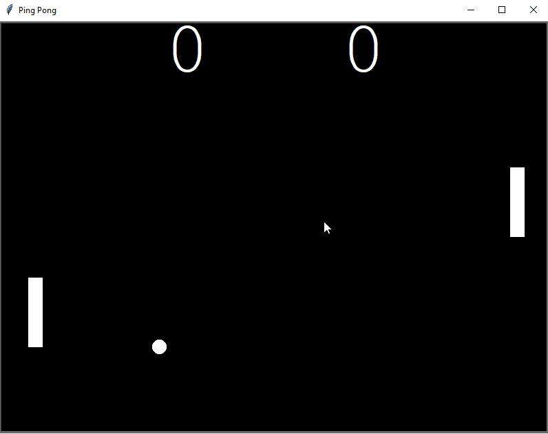

# Pong: The Famous Arcade Game

### Pong is a Very Famous Arcade game and is very famous among millennials.
## Summary
### This project tested my programming knowledge. I had to implement almost everything that I learned till now.
### Each player Control one paddle, if a player misses the ball one point is awarded to the opposing player. The speed of ball increases after every collision with the paddle. If a player misses the ball The speed is set to it's default.